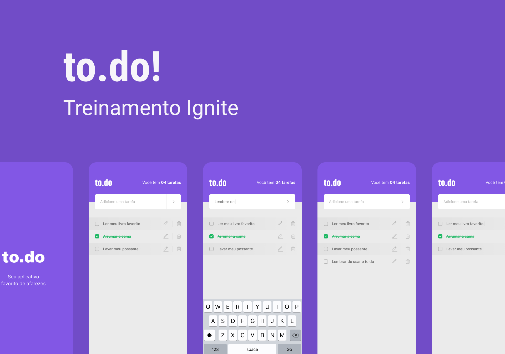
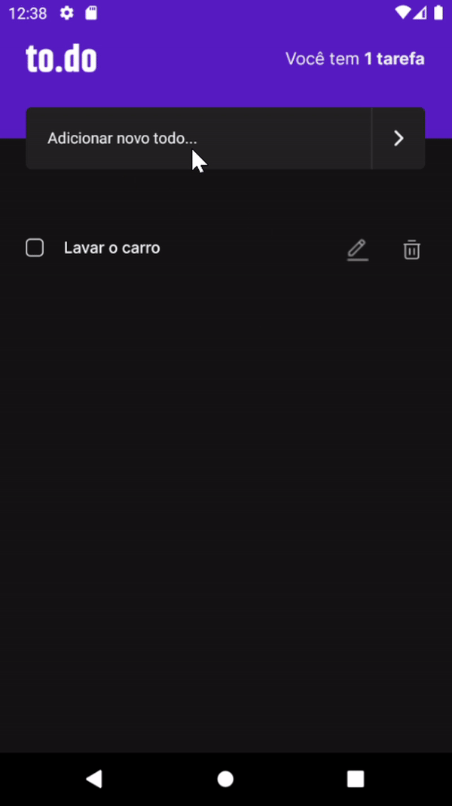

# to.do

This project was a challenge from the React Native Ignite bootcamp from Rocketseat.
 

    

## 💻 **Project**

---

to.do is nothing but a task organizer app.

### ⚙️ **Features**

- Add task;
- Remove task;
- Edit task;
- Mark task as done;
- Task counter;
- Alert when user tries to add a task that already exists;
- Alert to confirm task removal.

## ✨ **Technologies**

---

#### ✅ React Native

#### ✅ TypeScript

#### ✅ React Hooks
